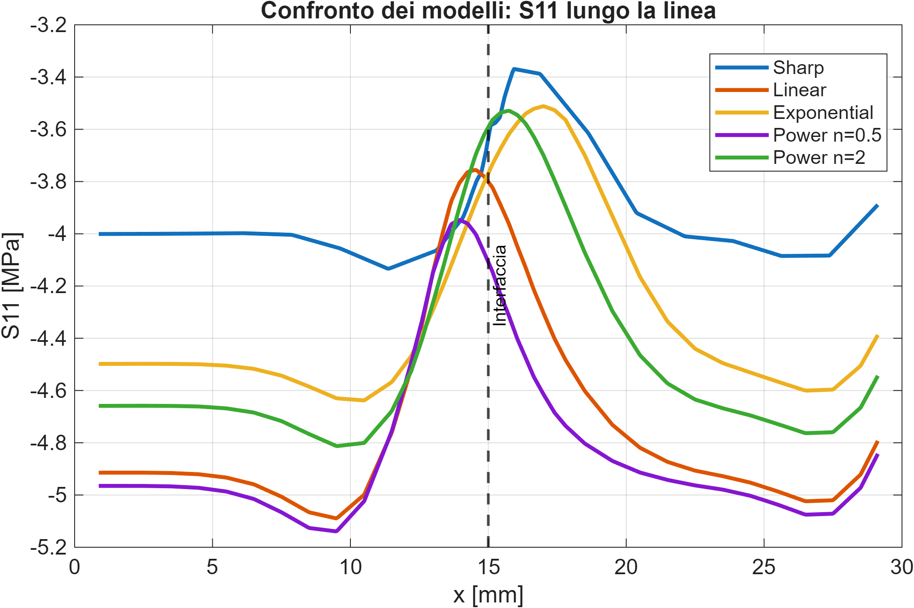
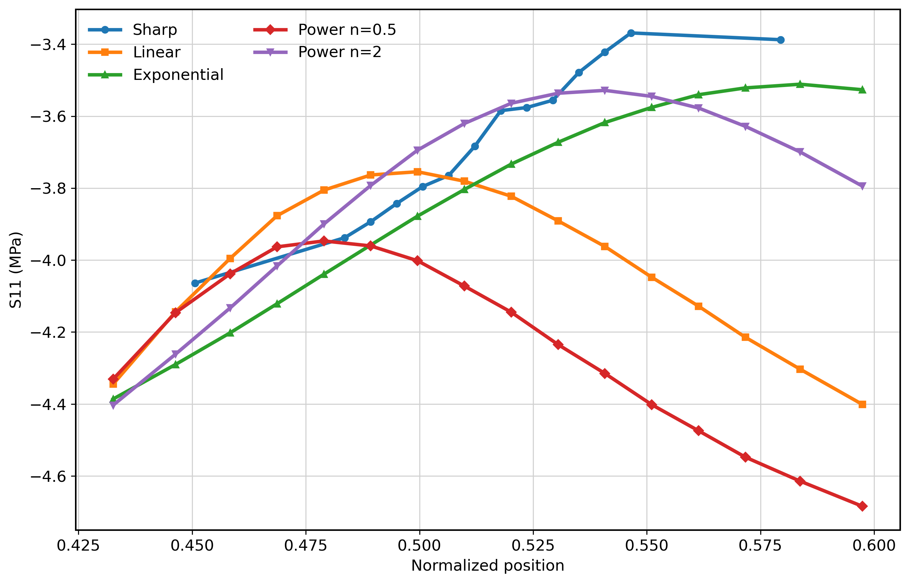

# Enthesis FEM Model – Stress Distribution in Functionally Graded Interfaces

## Overview

The tendon-to-bone interface (enthesis) is a biologically optimized structure characterized by a gradual transition in mechanical properties from soft tendon to stiff bone.

This project investigates how different material transition laws influence stress distribution across the interface using Finite Element Modeling (FEM).

The main objective is to evaluate whether functionally graded materials (FGMs) can reduce stress concentrations compared to sharp interfaces, and to identify the most mechanically effective transition law.

---

## Problem Statement

In engineering systems, abrupt changes in material properties often lead to stress concentrations and potential failure.

Biological systems, on the other hand, frequently adopt graded transitions to mitigate these effects.

The enthesis represents a paradigmatic example of this strategy.

This project aims to:

* model the tendon–bone interface using FEM
* implement different material gradient laws
* analyze stress distribution along the interface
* identify the most effective transition strategy

---

## Model Description

A simplified 2D FEM model is adopted to isolate the effect of material grading.

* Tendon region → low stiffness
* Bone region → high stiffness
* Enthesis → graded transition

The following configurations are implemented:

* Sharp interface (baseline)
* Linear gradient
* Exponential gradient
* Power-law gradient (n = 0.5)
* Power-law gradient (n = 2)

All models share identical:

* geometry
* mesh
* boundary conditions

Only the material law in the enthesis region is varied, ensuring a controlled comparison.

---

## Methodology

The project follows a structured and reproducible pipeline:

### FEM Simulation (Abaqus)

* geometry definition
* material assignment
* mesh generation
* boundary conditions
* solution stored as `.odb` files

### Data Extraction (Python)

* extraction of:

  * S11 stress
  * stress profiles along the interface
* export to CSV format

### Data Analysis (MATLAB / Python)

* interpolation on a common spatial grid
* comparison of S11(x) distributions
* computation of quantitative metrics
* generation of figures

---

## Results — Model Comparison

### Global Stress Distribution



### Zoom Near the Interface



---

## Key Findings

* The **sharp interface** exhibits the highest stress concentration
* Graded models significantly smooth the stress distribution
* The **linear gradient** reduces peak stress but maintains a relatively abrupt transition
* The **exponential model** improves stress redistribution
* The **power-law model (n = 0.5)** modifies the stress profile but does not significantly reduce peak values
* The **power-law model (n = 2)** provides the best balance between peak reduction and smooth load transfer

---

## Conclusions — Model Selection

The comparative analysis highlights the critical role of material transition laws in controlling stress distribution across the tendon–bone interface.

The **sharp interface** confirms the detrimental effect of stiffness discontinuities, producing pronounced stress concentrations.

Graded models significantly improve mechanical behavior:

* the **linear gradient** reduces peak stress but still shows relatively abrupt variation
* the **exponential model** ensures smoother redistribution
* the **power-law (n = 0.5)** does not effectively mitigate peak stress due to rapid stiffening

The **power-law model with n = 2** provides the most favorable response:

* reduced stress concentration
* smoother stress transition
* improved mechanical compatibility

### Selected Model

The **power-law model (n = 2)** is selected as the reference configuration for further development due to its superior performance in:

* minimizing stress peaks
* ensuring gradual load transfer
* reproducing a physically consistent transition

---

## Reproducibility

The entire workflow is fully reproducible:

1. run Abaqus simulations
2. execute Python extraction scripts
3. run MATLAB analysis scripts

All intermediate data is stored in CSV format.

---

## Repository Structure

```text
docs/      → technical documentation
models/    → FEM model descriptions and screenshots
scripts/   → Python/MATLAB post-processing
results/   → processed data and plots
paper/     → manuscript and figures
```

---

## Scope

This project focuses on isolating the effect of material grading on stress transfer, rather than optimizing geometry or modeling full biological complexity.

---

## Future Work (Phase 2)

The next phase introduces increased physical realism:

* variable Poisson’s ratio in the enthesis region
* comparison with constant Poisson models
* elastic energy analysis
* validation against literature trends

The goal is to strengthen the physical interpretation and move toward a more realistic representation of the biological interface.
