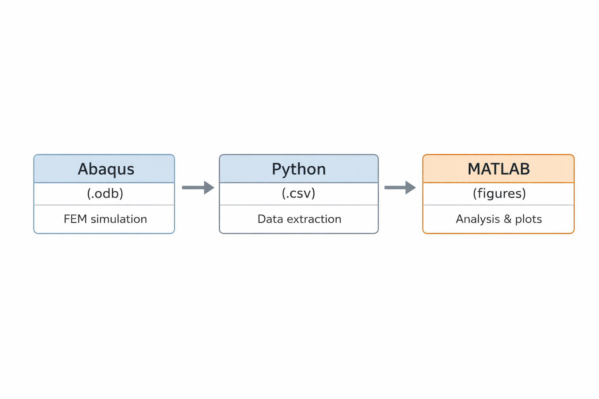
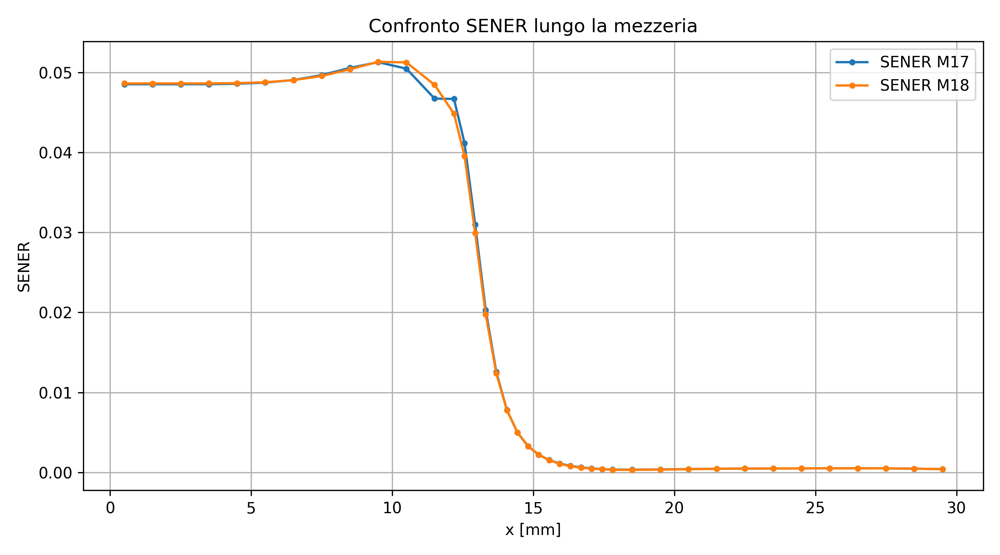

# Enthesis FEM Model – Stress and Energy Distribution in Functionally Graded Interfaces


## Overview

The tendon-to-bone interface (enthesis) is a biologically optimized structure characterized by a gradual transition in mechanical properties from compliant tendon to stiff bone.

This project investigates how different material transition laws influence both **stress distribution** and **elastic energy storage** across the interface using Finite Element Modeling (FEM).

The main objective is to evaluate whether functionally graded materials (FGMs) can reduce stress concentrations compared to sharp interfaces, and to identify the most mechanically effective transition law.

## Key Takeaways

- Functionally graded materials reduce stress concentrations
- Power-law (n = 2) provides optimal stress-energy balance
- Stress smoothing correlates with distributed elastic energy
- Results are consistent with FGM theory

---

## Problem Statement

In engineering systems, abrupt changes in material properties often lead to stress concentrations and structural failure.

Biological systems, in contrast, frequently adopt **graded transitions** to mitigate these effects.

The enthesis represents a paradigmatic example of this strategy.

This project aims to:

- model the tendon–bone interface using FEM  
- implement different material gradient laws  
- analyze stress distribution along the interface  
- evaluate elastic energy distribution  
- identify the most effective transition strategy  

---

## Model Description

A simplified 2D FEM model is adopted to isolate the effect of material grading.

- Tendon region → low stiffness  
- Bone region → high stiffness  
- Enthesis → graded transition  

### Implemented Configurations

- Sharp interface (baseline)  
- Linear gradient  
- Exponential gradient  
- Power-law gradient (n = 0.5)  
- Power-law gradient (n = 2)  

All models share identical:

- geometry  
- mesh  
- boundary conditions  

Only the material law in the enthesis region is varied, ensuring a **controlled mechanical comparison**.

---

## Methodology

The project follows a structured and fully reproducible pipeline:

### 1. FEM Simulation (Abaqus)

- geometry definition  
- material assignment  
- mesh generation  
- boundary conditions  
- solution stored as `.odb` files  

### 2. Data Extraction (Python)

Extraction of physically meaningful quantities:

- S11 stress component  
- stress profiles along the interface  
- elastic strain energy (SENER / ALLSE)  

Outputs:

- structured CSV datasets  
- model-wise and combined data  

### 3. Data Analysis (MATLAB / Python)

- interpolation on a common spatial grid  
- comparison of S11(x) distributions  
- analysis of energy distribution  
- correlation between stress and energy  
- computation of quantitative metrics  
- generation of publication-ready figures

## Workflow



---

## Results Overview

The comparative analysis focuses on stress and energy distribution along the tendon–bone interface.

Key evaluation criteria include:

- peak stress magnitude  
- smoothness of stress distribution  
- spatial localization of elastic energy  
- consistency between stress and energy trends  

The results highlight clear differences between sharp and graded configurations, providing a quantitative basis for model selection.

## Visual Results

### Stress Distribution Along the Interface


---

## Key Findings

- The **sharp interface** exhibits the highest stress concentration  
- Graded models significantly smooth the stress distribution  
- The **linear gradient** reduces peak stress but maintains a relatively abrupt transition  
- The **exponential model** improves stress redistribution  
- The **power-law model (n = 0.5)** modifies the stress profile but does not significantly reduce peak values  
- The **power-law model (n = 2)** provides the best balance between peak reduction and smooth load transfer  

### Energy-Based Insight

- Elastic energy distribution confirms stress-based observations  
- Efficient models show **distributed energy storage**, not localized peaks  
- The best-performing configurations minimize both:
  - stress concentration  
  - energy localization  

---

## Conclusions — Model Selection

The comparative analysis highlights the critical role of material transition laws in controlling stress and energy distribution across the tendon–bone interface.

The **sharp interface** confirms the detrimental effect of stiffness discontinuities, producing pronounced stress concentrations and localized energy accumulation.

Graded models significantly improve mechanical behavior:

- the **linear gradient** reduces peak stress but still shows relatively abrupt variation  
- the **exponential model** ensures smoother redistribution  
- the **power-law (n = 0.5)** does not effectively mitigate peak stress due to rapid stiffening  

The **power-law model with n = 2** provides the most favorable response:

- reduced stress concentration  
- smoother stress transition  
- improved energy distribution  
- enhanced mechanical compatibility  

### Selected Model

The **power-law model (n = 2)** is selected as the reference configuration due to its superior performance in:

- minimizing stress peaks  
- ensuring gradual load transfer  
- distributing elastic energy efficiently  
- reproducing a physically consistent transition  

---

## Advanced Model Development (Phase 2)

To improve the physical realism of the model, a second development phase was implemented.

### Objectives

- introduce additional physical mechanisms  
- validate stress-based results through energy analysis  
- assess the robustness of the selected material law  

---

### Implemented Enhancements

#### Variable Poisson’s Ratio

- spatial variation of ν within the enthesis region  
- comparison with constant ν models  
- evaluation of transverse deformation effects  

---

#### Elastic Energy Analysis

- extraction of elastic strain energy (SENER)  
- evaluation of energy distribution along the interface  
- identification of energy concentration zones

#### Elastic Energy Distribution



---

#### Stress–Energy Correlation

- comparison between S11 and SENER distributions  
- assessment of local vs global mechanical response  
- validation of stress smoothing through energy redistribution  

---

### Key Outcomes

- variable Poisson’s ratio has a secondary but non-negligible effect  
- the overall stress distribution remains consistent across models  
- energy analysis confirms the mechanical advantage of graded interfaces  
- the **power-law model (n = 2)** remains the most effective configuration  

---

## Final Remarks

The combined analysis of stress and elastic energy provides a unified and physically consistent interpretation of the tendon–bone interface behavior.

The results demonstrate that:

- graded material transitions significantly improve mechanical performance  
- stress redistribution is directly supported by energy redistribution  
- the selected model captures the essential mechanics of the enthesis  

This establishes a solid foundation for future extensions toward more complex and realistic biological models.

---

## Reproducibility

The entire workflow is fully reproducible:

1. run Abaqus simulations  
2. execute Python extraction scripts  
3. run MATLAB/Python analysis scripts  

All intermediate data is stored in CSV format.

---

## Repository Structure

```text
docs/      → technical documentation
models/    → FEM model descriptions and screenshots
scripts/   → Python/MATLAB post-processing
results/   → processed data and plots
paper/     → manuscript and figures
```

---

## Scope

This project focuses on isolating the effect of material grading on stress transfer and energy distribution, rather than optimizing geometry or modeling full biological complexity.
