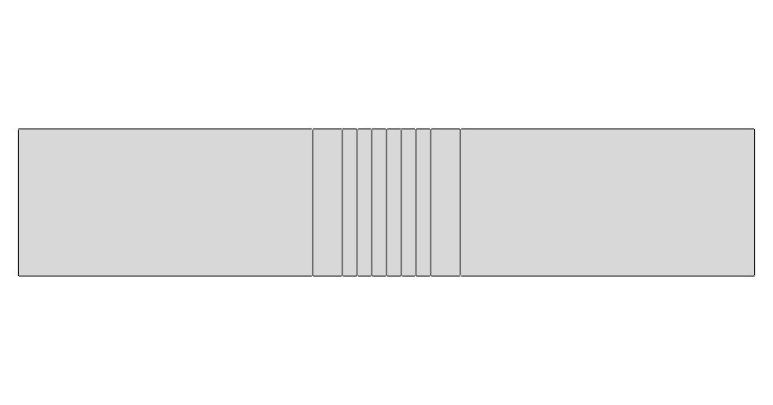
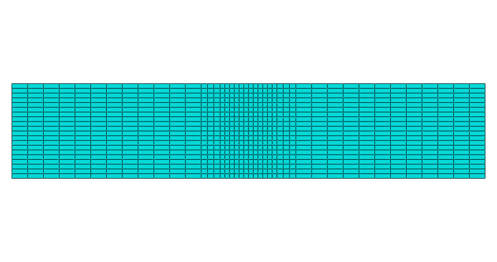
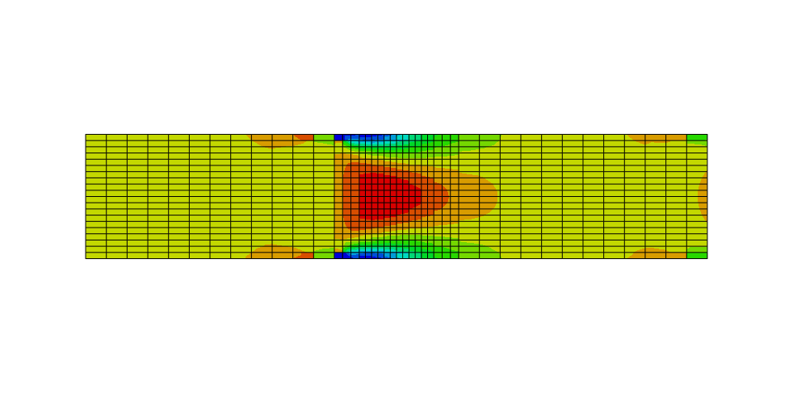

# M02 – Linear Graded Interface

## Description

This model introduces a linear variation of Young’s modulus across the tendon–bone interface, replacing the sharp discontinuity with a gradual transition.

## Geometry

- 2D planar rectangular model
- Total length: 30 mm
- Height: 6 mm
- Tendon region: 12 mm
- Enthesis region: 6 mm
- Bone region: 12 mm

## Interface Discretization

The enthesis region is discretized into 8 layers:

- 2 outer layers: 1.2 mm each
- 6 inner layers: 0.6 mm each

This discretization is used to approximate a continuous linear gradient.

## Material Properties

### Tendon
- Young’s modulus: 200 MPa
- Poisson’s ratio: 0.45

### Bone
- Young’s modulus: 20000 MPa
- Poisson’s ratio: 0.30

### Enthesis
- Young’s modulus varies linearly from tendon to bone
- Poisson’s ratio initially assumed uniform

## Interface Modeling

The elastic modulus assigned to each enthesis layer is obtained through linear interpolation between tendon and bone properties.

## Analysis Setup

- Software: Abaqus/CAE
- Model type: 2D planar
- Formulation: Plane Stress
- Step: Static, General
- NLGEOM: OFF

## Boundary Conditions

- Right edge (bone side): U1 = 0, U2 = 0
- Left edge (tendon side): imposed displacement U1 = 0.3 mm
- U2 free on the loaded side

## Mesh

- Element type: CPS4R
- Refined mesh in the enthesis region

## Purpose

This model is used to evaluate whether a linear graded transition reduces stress concentration compared to the sharp interface baseline.

## Expected Behavior

Compared to the sharp model, the linear graded interface is expected to:

- reduce stress concentration near the interface
- redistribute stress more smoothly
- provide a more physiologically meaningful load transfer

## Visuals

### Geometry

### Mesh

### Boundary Conditions

### Stress Distribution (S11)

