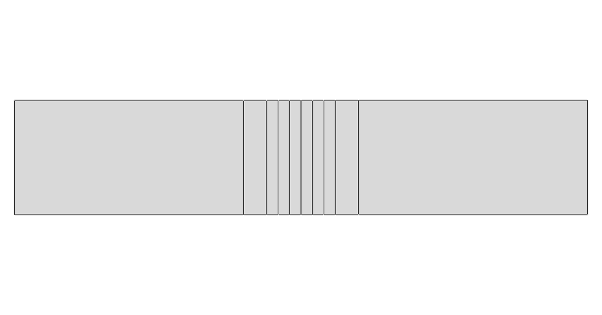
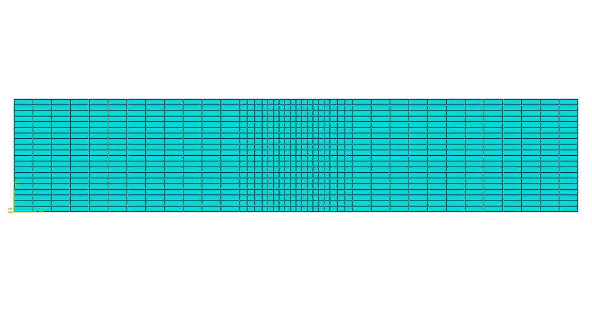
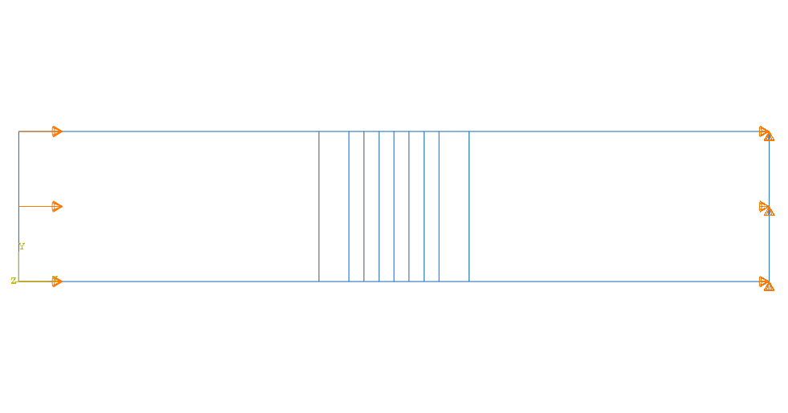
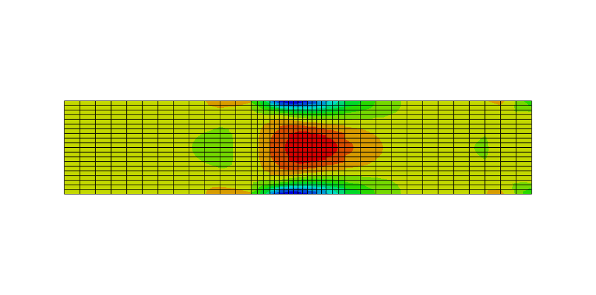

# M10 – Refinement Model (8 Layers)

## Description

This model is part of the refinement study carried out in Phase 2.

It uses a power-law material gradient with exponent n = 2 and discretizes the enthesis region into 8 layers.

This model serves as the baseline refinement configuration for comparison with finer discretizations.

## Geometry

* 2D planar rectangular model
* Total length: 30 mm
* Height: 6 mm
* Tendon region: 12 mm
* Enthesis region: 6 mm
* Bone region: 12 mm

## Interface Discretization

The enthesis region is discretized into 8 layers with non-uniform thickness:

* 2 outer layers: 1.2 mm each
* 6 inner layers: 0.6 mm each

This discretization is consistent with the baseline configuration used in Phase 1 and allows for a better representation of the transition near the tendon and bone regions.

The use of thicker outer layers ensures a smoother connection with the adjacent homogeneous materials, while the thinner inner layers improve the resolution within the graded region.

### Tendon

* Young’s modulus: 200 MPa
* Poisson’s ratio: 0.45

### Bone

* Young’s modulus: 20000 MPa
* Poisson’s ratio: 0.30

### Enthesis

* Young’s modulus follows a power-law distribution
* exponent: n = 2
* Poisson’s ratio initially assumed constant

## Interface Modeling

The elastic modulus assigned to each enthesis layer is obtained from a power-law function evaluated at the center of each layer.

## Analysis Setup

* Software: Abaqus/CAE
* Model type: 2D planar
* Formulation: Plane Stress
* Step: Static, General
* NLGEOM: OFF

## Boundary Conditions

* Right edge (bone side): U1 = 0, U2 = 0
* Left edge (tendon side): imposed displacement U1 = 0.3 mm
* U2 free on the loaded side

## Mesh

* Element type: CPS4R
* Refined mesh in the enthesis region
* Coarsest refinement level within the Phase 2 refinement study

## Purpose

This model is used as the baseline configuration in the refinement study to evaluate the effect of interface discretization on stress distribution.

## Expected Behavior

Compared to finer refinement models, the 8-layer configuration is expected to:

* approximate the material gradient more coarsely
* show slightly less smooth stress distributions
* retain the main trend observed in the selected power-law model

## Visuals

### Geometry

### Mesh

### Boundary Conditions

### Stress Distribution (S11)

