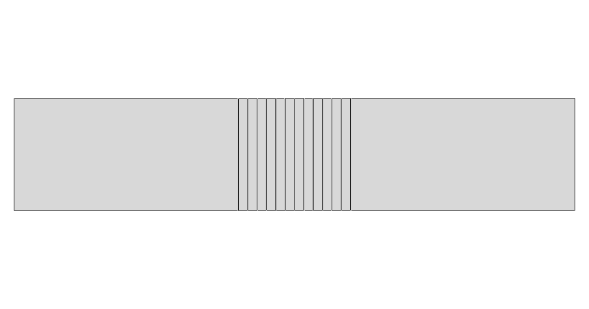
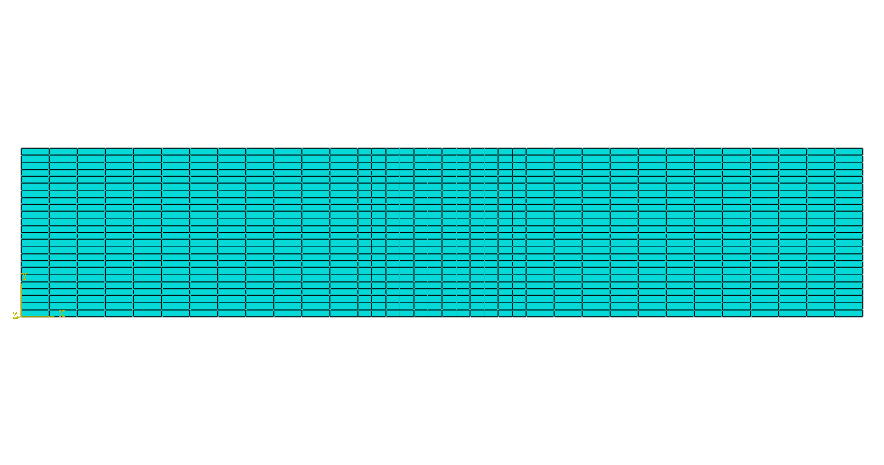
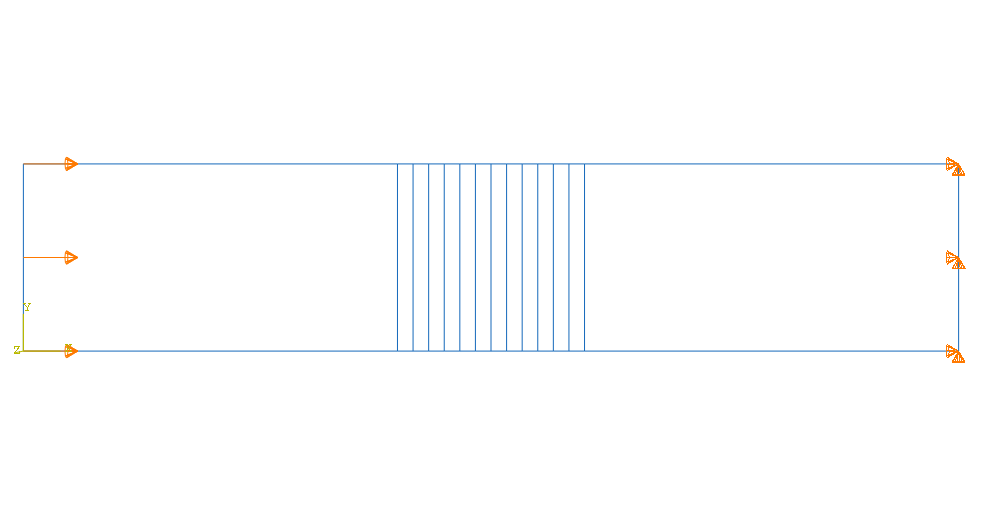
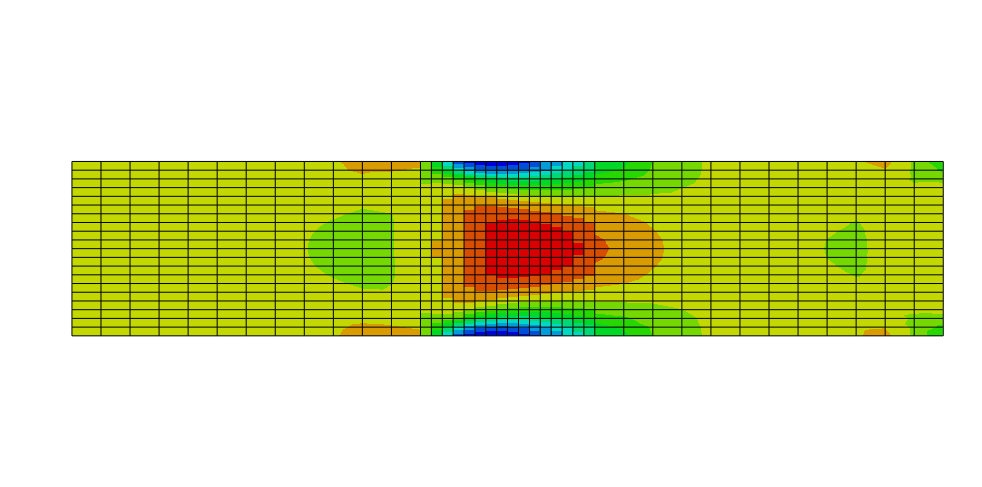

# M11 – Refinement Model (12 Layers)

## Description

This model is part of the refinement study carried out in Phase 2.

It uses a power-law material gradient with exponent n = 2 and discretizes the enthesis region into 12 layers.

This model represents an intermediate refinement level between the 8-layer and 16-layer configurations.

## Geometry

* 2D planar rectangular model
* Total length: 30 mm
* Height: 6 mm
* Tendon region: 12 mm
* Enthesis region: 6 mm
* Bone region: 12 mm

## Interface Discretization

The enthesis region is discretized into 12 layers.

This refinement improves the representation of the material gradient compared to the 8-layer model while maintaining moderate computational cost.

## Material Properties

### Tendon

* Young’s modulus: 200 MPa
* Poisson’s ratio: 0.45

### Bone

* Young’s modulus: 20000 MPa
* Poisson’s ratio: 0.30

### Enthesis

* Young’s modulus follows a power-law distribution
* exponent: n = 2
* Poisson’s ratio initially assumed constant

## Interface Modeling

The elastic modulus assigned to each enthesis layer is obtained from a power-law function evaluated at the center of each layer.

## Analysis Setup

* Software: Abaqus/CAE
* Model type: 2D planar
* Formulation: Plane Stress
* Step: Static, General
* NLGEOM: OFF

## Boundary Conditions

* Right edge (bone side): U1 = 0, U2 = 0
* Left edge (tendon side): imposed displacement U1 = 0.3 mm
* U2 free on the loaded side

## Mesh

* Element type: CPS4R
* Refined mesh in the enthesis region
* Intermediate refinement level within the Phase 2 refinement study

## Purpose

This model is used to evaluate whether increasing the number of layers from 8 to 12 improves the smoothness and consistency of stress transfer across the interface.

## Expected Behavior

Compared to the 8-layer model, the 12-layer configuration is expected to:

* better approximate a continuous material gradient
* reduce discretization-related irregularities
* provide a smoother stress profile

## Visuals

### Geometry

### Mesh

### Boundary Conditions

### Stress Distribution (S11)

