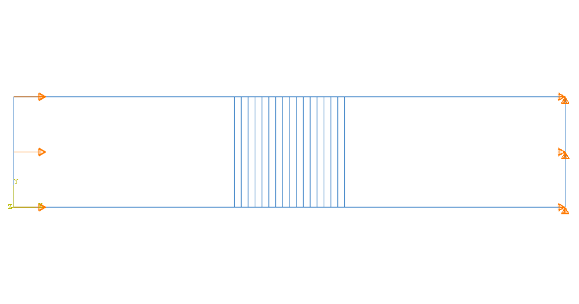

# M17 – Constant Poisson’s Ratio Model

## Description

This model is part of the Poisson’s ratio sensitivity study carried out in Phase 2.

It uses a power-law material gradient with exponent n = 3 and a refined discretization of the enthesis region with 16 layers.

In this configuration, Poisson’s ratio is assumed constant across all regions.

## Geometry

* 2D planar rectangular model
* Total length: 30 mm
* Height: 6 mm
* Tendon region: 12 mm
* Enthesis region: 6 mm
* Bone region: 12 mm

## Interface Discretization

The enthesis region is discretized into 16 layers of equal thickness.

## Material Properties

### Tendon

* Young’s modulus: 200 MPa
* Poisson’s ratio: 0.45

### Bone

* Young’s modulus: 20000 MPa
* Poisson’s ratio: 0.30

### Enthesis

* Young’s modulus follows a power-law distribution
* exponent: n = 3
* Poisson’s ratio: constant

## Interface Modeling

The elastic modulus assigned to each enthesis layer is obtained from a power-law function evaluated at the center of each layer.

## Analysis Setup

* Software: Abaqus/CAE
* Model type: 2D planar
* Formulation: Plane Stress
* Step: Static, General
* NLGEOM: OFF

## Boundary Conditions

* Right edge (bone side): U1 = 0, U2 = 0
* Left edge (tendon side): imposed displacement U1 = 0.3 mm
* U2 free on the loaded side

## Mesh

* Element type: CPS4R
* Refined mesh in the enthesis region

## Purpose

This model serves as the reference configuration to evaluate the influence of Poisson’s ratio variation on stress and energy distribution.

## Expected Behavior

The constant Poisson’s ratio configuration is expected to:

* provide a baseline for comparison
* isolate the effect of Young’s modulus variation

## Visuals

### Geometry

### Mesh

### Boundary Conditions

### Stress Distribution (S11)

